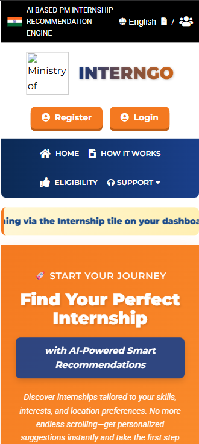

# 🚀 InternGo: AI-Based Internship Recommendation Engine

InternGo is an AI-powered internship recommendation system developed for the Smart India Hackathon (SIH).

The system aims to help students, especially first-generation learners and candidates from rural and underserved regions, discover internships that best match their skills, interests, educational background, and location preferences.

Instead of presenting users with hundreds of internship listings, InternGo intelligently recommends the top 3-5 most relevant opportunities.

---

## 📌 Problem Statement

**Problem Statement ID:** 25034

**Title:** AI-Based Internship Recommendation Engine for PM Internship Scheme

**Organization:** Ministry of Corporate Affairs (MoCA)

**Theme:** Smart Education

---

## 🎯 Objective

To build a lightweight, mobile-friendly, and user-centric recommendation system that:

- Captures candidate information.
- Analyzes skills, interests, and preferences.
- Recommends personalized internships.
- Improves application relevance.
- Enhances accessibility for users with low digital literacy.

---

## ✨ Features

✅ Personalized internship recommendations

✅ Skill-based matching

✅ Interest-based filtering

✅ Location preference support

✅ Mobile-responsive interface

✅ Simple and intuitive UI

✅ Lightweight recommendation engine

✅ Visual recommendation cards

---

## 🏗️ System Architecture

```text
                 Candidate Profile
                           |
    -------------------------------------------------
    |                 |                |            |
 Education         Skills         Interests     Location
    |                 |                |            |
    -------------------------------------------------
                           |
                 Recommendation Engine
                           |
          Rule-Based / ML Recommendation Model
                           |
                  Ranking & Scoring Module
                           |
                    Top 3-5 Recommendations
                           |
                      User Interface
```

---

## 📂 Project Structure

```text
InternGo/
│
├── static/                     # CSS, JavaScript, images
├── templates/                 # HTML pages
├── Procfile
├── flaaaask.py                # Main Flask application
├── analysis_ready_dataset.csv # Internship dataset
├── evaluation_report.json
├── dataset_documentation.json
├── README.md
└── requirements.txt
```

---

## 🧠 Recommendation Methodology

The recommendation engine considers:

- Academic background
- Educational qualification
- Technical skills
- Sector interests
- Preferred location
- User preferences

Each internship opportunity is assigned a relevance score based on profile matching.

The top-ranked internships are then displayed to the user.

---

## 🛠️ Technology Stack

### Frontend

- HTML
- CSS
- JavaScript

### Backend

- Python
- Flask

### Data Processing

- Pandas
- NumPy

### Recommendation Techniques

- Rule-Based Filtering
- Content-Based Recommendation
- Similarity Scoring

---

## 📸 Screenshots

### Home Page


### Candidate Input Form


### Recommendation Results


### Mobile View



---

## ⚙️ Installation

Clone the repository:

```bash
git clone https://github.com/NejiHyuga55/Interngo.git
```

Move to the project directory:

```bash
cd Interngo
```

Install dependencies:

```bash
pip install -r requirements.txt
```

---

## ▶️ Running the Application

Run the Flask server:

```bash
python flaaaask.py
```

Open:

```text
http://127.0.0.1:5000/
```

---

## 📊 Sample User Inputs

| Parameter | Example |
|-----------|---------|
| Education | B.Tech CSE |
| Skills | Python, SQL |
| Interests | AI, Data Science |
| Location | Delhi NCR |

---

## 🎯 Sample Output

The system recommends:

1. AI Intern – Delhi
2. Data Analyst Intern – Noida
3. Software Development Intern – Gurgaon
4. ML Intern – Remote
5. Research Intern – Bengaluru

---

## 🔮 Future Scope

- Regional language support.
- Voice-assisted interaction.
- Explainable AI recommendations.
- Resume-based recommendation.
- Chatbot integration.
- Real-time internship APIs.
- Hybrid recommendation models.

---

## 👥 Team

Developed for **Smart India Hackathon (SIH)**.

Team Members:

- Hriday Thakur
- Kanishka Jain
- Keshav Chakraborty
- Vaibhav Sunola
- Ajitej Singh
- Pratham Bhatnagar

---

## 🤝 Contribution

Contributions, suggestions, and improvements are welcome.

Feel free to fork the repository and submit pull requests.

---

## 📄 License

This project is licensed under the MIT License.

---

## ⭐ Acknowledgements

- Smart India Hackathon (SIH)
- Ministry of Corporate Affairs
- Bennett University
